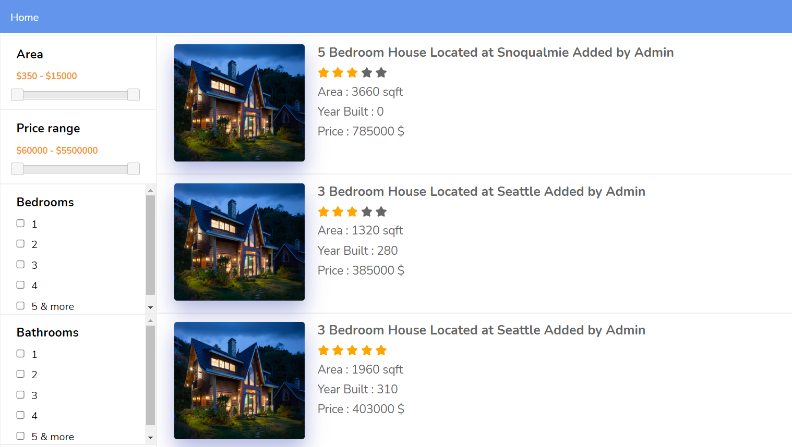
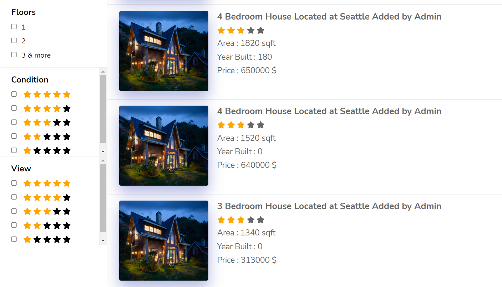
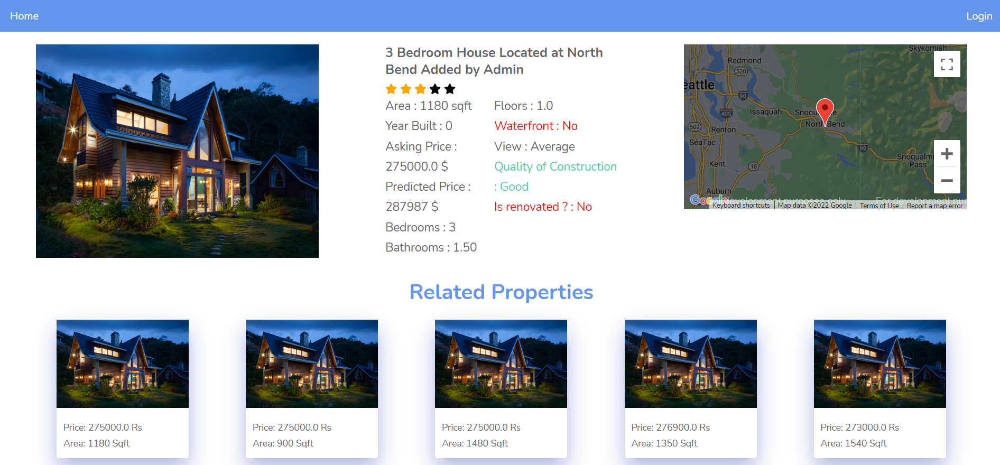
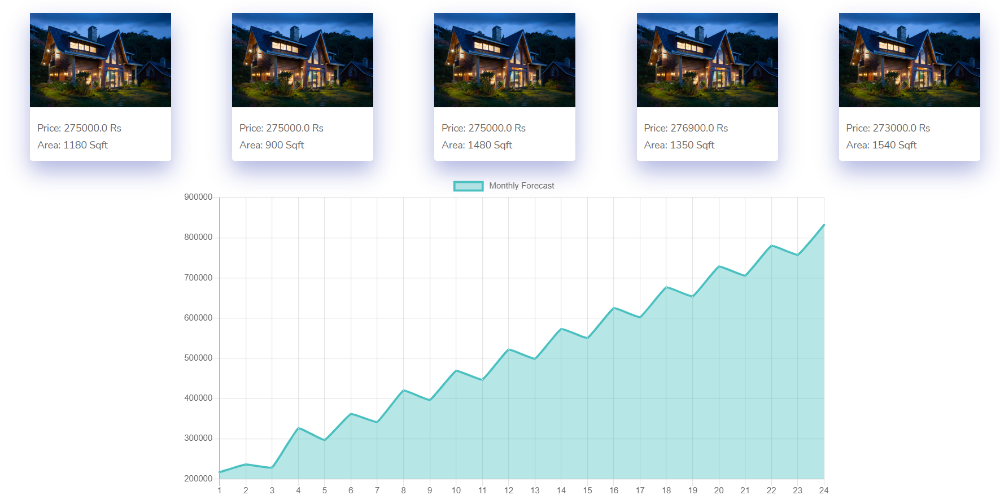
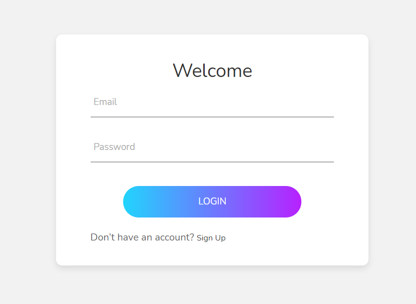
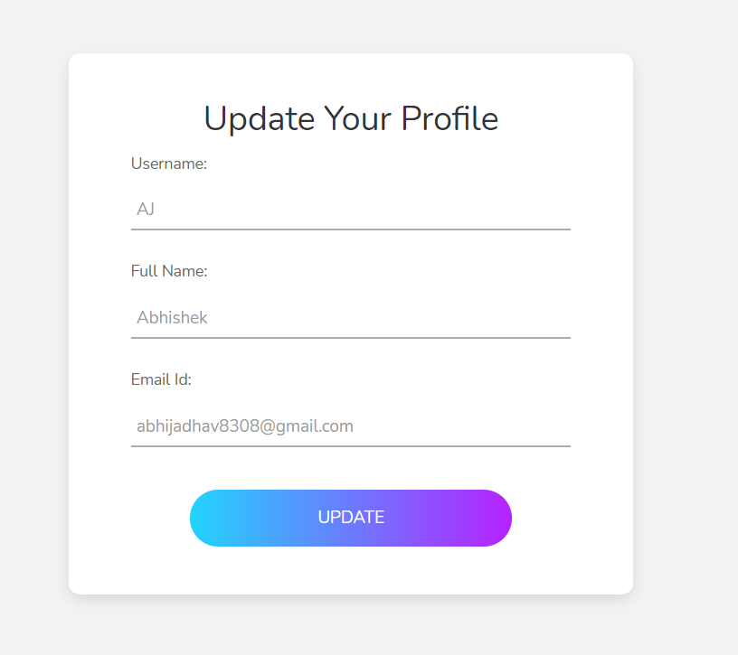
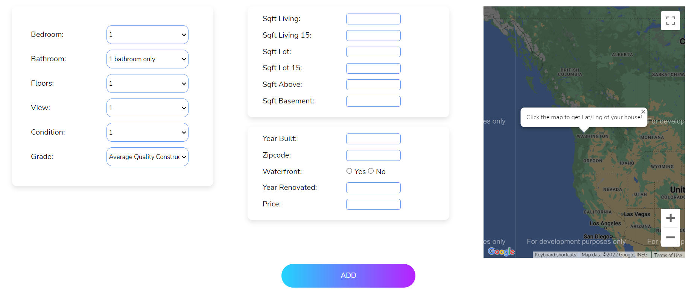
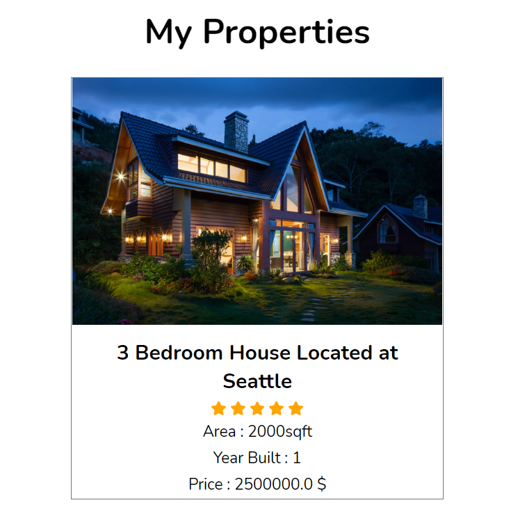

# House-Price-Prediction

Hi everyone, welcome to my repo. I have built **House Price Prediction** system for predicting current and future price of the house. It also consists of Custom Recommendation Algorithm Logic, Google Maps API, Real Time Filters using AJAX. Hope you like it :)

The system makes use of Flask and FlaskMySQLDB for backend processing and connection. 

---

## What features make this project unique ?
-  Catboost Regression Algorithm
-  Time Series Value Prediction Algorithm
-  Recommendation System Custom Algorithm
-  Google Maps API
-  Real Time Search Results with filters using AJAX
-  Python, Flask, Flask-MySQLdb

## How to get it running on your system ?

1. Download the source code
2. Install and switch to virtualenv on your machine (optional)
3. Install the requirements file ( **Python version 3.8.0 preferred** )
4. Create a database named house_price_prediction(any other name is also fine, but don't forget to make changes in code) and import smart_buy.sql (located inside Dataset folder) file in your MySQL client
5. Change app.config settings according to your MySQL configuration
6. Run the main.py file (CMD command - `python main.py`)
7. Put the localhost address with port no 5000 in any of the browser on your machine `localhost:5000`

It's that easy! Have a nice day.

## Screenshots

***

***

***

***

***

***

***

***

